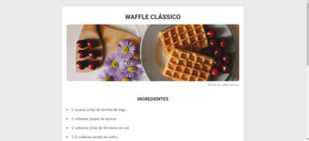
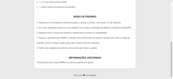
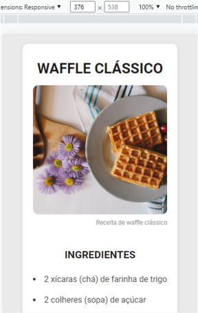
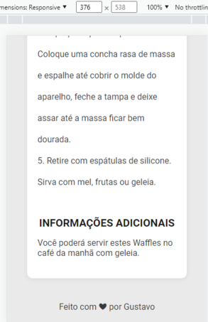

<h1 align='center'>Recipe Page</h1>

  <a href="#-sobre">Sobre</a>&nbsp;&nbsp;&nbsp;|&nbsp;&nbsp;&nbsp;
  <a href="#-prints-de-tela">Prints de tela</a>&nbsp;&nbsp;&nbsp;|&nbsp;&nbsp;&nbsp;
  <a href="#-tecnologias">Tecnologias</a>&nbsp;&nbsp;&nbsp;|&nbsp;&nbsp;&nbsp;
  <a href="#-author">Autor</a>&nbsp;&nbsp;&nbsp;|&nbsp;&nbsp;&nbsp;
  <a href="#-licença">Licença</a>&nbsp;&nbsp;&nbsp;|&nbsp;&nbsp;&nbsp;

🚀 Desafio concluído ✅

💻 Sobre
É uma página de receita simples ensinando a fazer waffles clássico. O projeto é a resolução de um desafio de HTML e CSS da Rocketseat. [Link para página do desafio](https://efficient-sloth-d85.notion.site/Desafio-Piloto-P-gina-de-Receita-15acc6a34f744484a2e64a1f115bfbae).

📷 Prints de tela
 
  

🛠 Tecnologias

- Linguagens: 
    - [HTML](https://developer.mozilla.org/pt-BR/docs/Web/HTML) 
    - [CSS](https://developer.mozilla.org/pt-BR/docs/Web/CSS)
- Ferramentas 
    - Editor: [Visual Studio Code](https://code.visualstudio.com/)
    - Fonts: [Roboto](https://fonts.google.com/specimen/Roboto)
 

🦸‍♂️ Autor 

Feito com ❤️ By Gustavo Victor

📝 Licença 

O projeto está sob a [Licensa MIT](./LICENSE) 

Todo mundo pode usar, clonar e contribuir com este projeto. 

